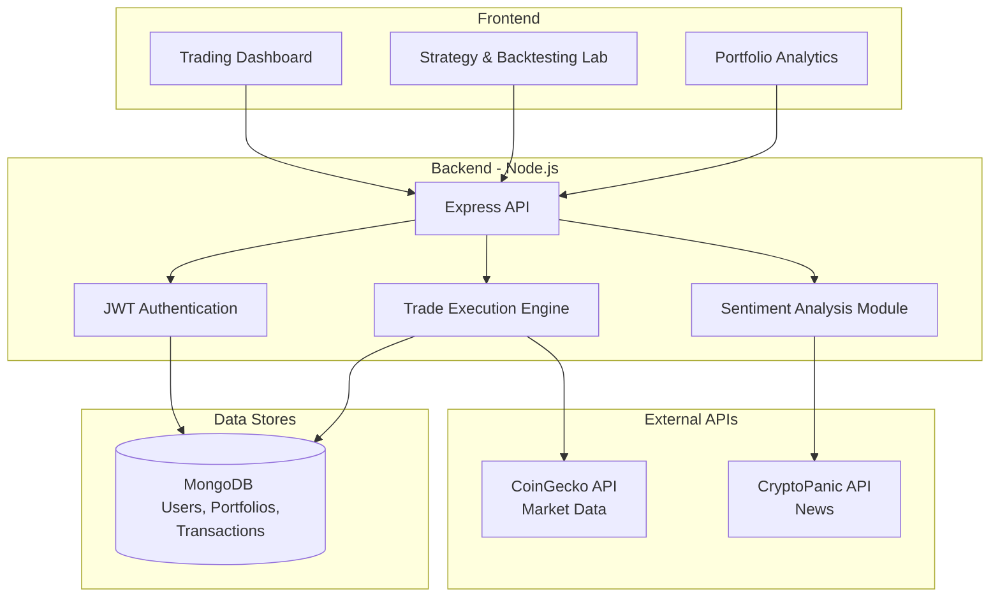
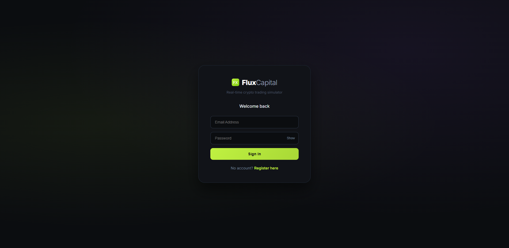

# Sentiment-Aware Cryptocurrency Trading Simulator

A full-stack platform integrating live market data, news-derived sentiment analysis, behavioral fear-and-greed indicators, virtual paper trading execution, portfolio analytics, and configurable strategy backtesting. This provides a realistic yet risk-free environment for experimenting with crypto markets.

## Key Features

- **Live Market Data**: Real-time coin prices and historical charts (CoinGecko).
- **Sentiment Intelligence**: Crypto news analysis and market mood indicators (CryptoPanic).
- **Paper Trading**: Virtual buy/sell execution with transaction persistence.
- **Portfolio Analytics**: Track invested capital, unrealized PnL, and historical valuation curves.
- **Strategy Backtesting**: Test configurations combining sentiment, momentum, and psychology signals against benchmarks.

## System Architecture

## Screenshots

  
  
  

## Tech Stack

- **Frontend**: React, Chart.js
- **Backend**: Node.js, Express
- **Database**: MongoDB (Mongoose)
- **Security**: JWT Authentication, bcrypt, Express Rate Limit
